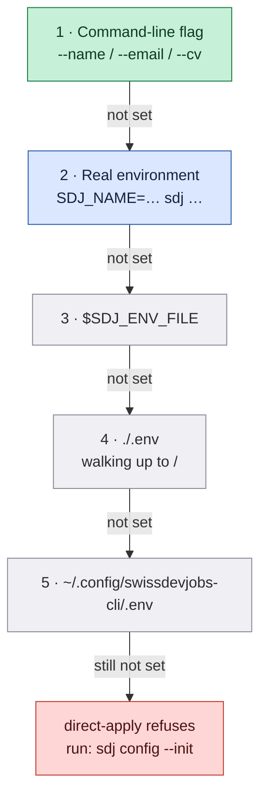
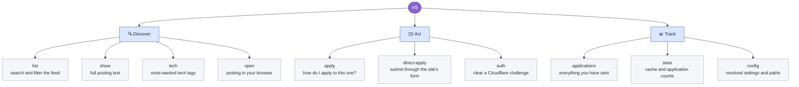
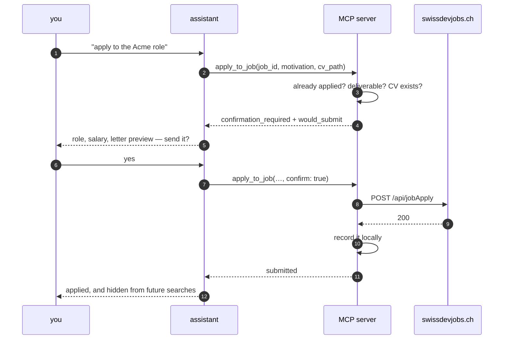
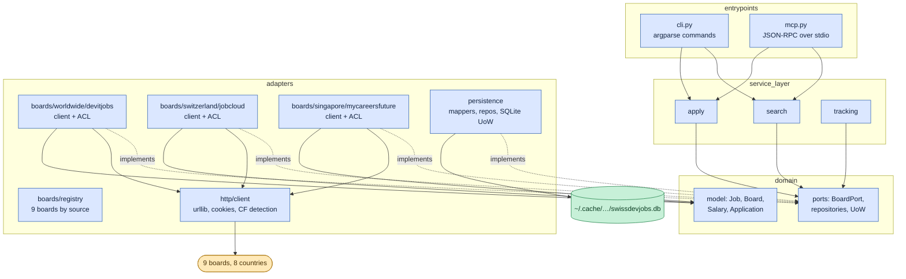
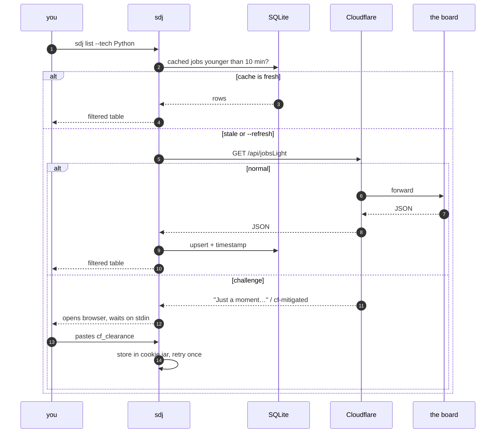
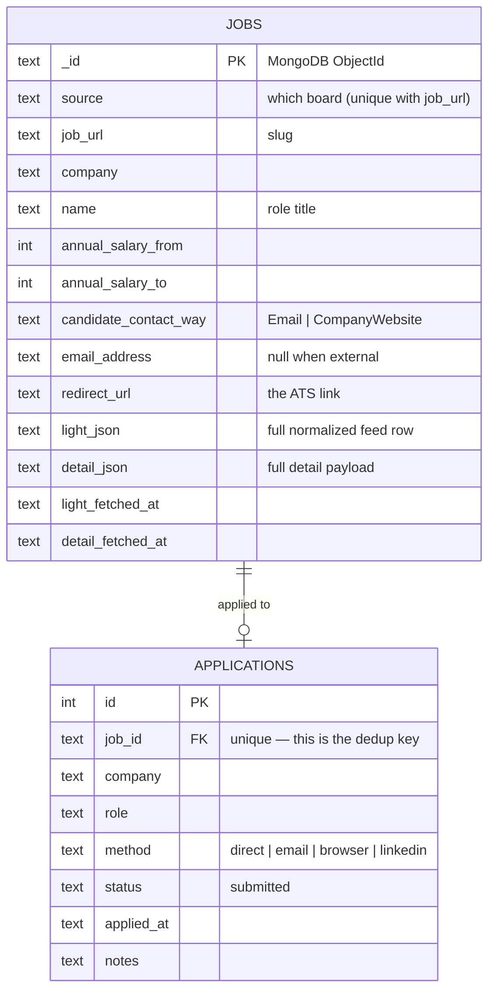

<div align="center">

# 🇨🇭 swissdevjobs-cli

**Search, filter, and apply across 9 job boards in 8 countries — ~4,700 tech jobs with salary data, plus all ~50,000 Swiss postings on jobs.ch & jobup.ch and ~9,000 Singapore IT postings on MyCareersFuture — without leaving your terminal.**

🇨🇭 Switzerland · 🇩🇪 Germany · 🇬🇧 UK · 🇺🇸🇨🇦 US & Canada · 🇳🇱 Netherlands · 🇫🇷 France · 🇸🇬 Singapore

[](LICENSE)
[](https://www.python.org/)
[](pyproject.toml)
[](#boards)
[](#install)
[](#mcp-server)
[](https://github.com/Stupidoodle/swissdevjobs-cli/actions/workflows/ci.yml)

</div>

---

Every posting on [swissdevjobs.ch](https://swissdevjobs.ch) — and its five sister
boards covering Germany, the UK, the US & Canada, the Netherlands, and France — is
required to publish a salary range. That makes them the rare job boards where you can
filter by pay before you click. Since v0.5 the tool also searches
[jobs.ch](https://www.jobs.ch) and [jobup.ch](https://www.jobup.ch) — Switzerland's
two biggest boards, every industry, ~50,000 postings. It also searches
[MyCareersFuture](https://www.mycareersfuture.gov.sg), Singapore's government
job portal, scoped to its ~9,000 Information Technology postings. One search,
nine boards, JSON-first so an LLM agent can drive it.

It also remembers what you've already applied to, across every board, so the same
job never shows up twice.

```console
$ sdj list --tech Kubernetes --remote --min-salary 90000 --sort salary
57 shown · 57 match filters · 5521 in feed · 3 hidden (already applied)
----------------------------------------------------------------------------------------
6a60ec82…  devitjobs-us    p=2026-07-22  Senior Maximo Systems Developer/Integrator  TEKsystems c/o Allegis Gr  Ottawa   USD 208'000–270'400  remote  API, Ansible, Bash, ESB, GIS, IBM
6a6cc9bd…  devitjobs-us    p=2026-07-31  Senior Solutions Architect                  TEKsystems c/o Allegis Gr  Calgary  USD 187'200–228'800  remote  AI, API, Architect, Cloud, Docker
```

## Contents

- [Why](#why) · [Please be reasonable](#please-be-reasonable) · [Install](#install) · [Boards](#boards) · [Configure](#configure) · [Commands](#commands)
- [How applying works](#how-applying-works) · [Filtering](#filtering)
- [MCP server](#mcp-server) · [Under the hood](#under-the-hood) · [Cloudflare](#cloudflare)
- [Claude Code skill](#claude-code-skill) · [Development](#development)

---

## Why

| | |
|---|---|
| 🌍 **Nine boards, one tool** | The all-IT devitjobs family across six countries, plus jobs.ch & jobup.ch for every industry in Switzerland and MyCareersFuture for Singapore IT roles — one search, per-board currencies |
| 💰 **Salary is a first-class filter** | `--min-salary 130000` — no more opening 40 tabs to find the range |
| 📅 **Real posting dates** | The site re-stamps `activeFrom` when it bumps a listing. This decodes the true creation time from the MongoDB ObjectId, so a "new" job that's actually four months old can't fool you |
| 🧠 **Remembers where you applied** | Local SQLite. Applied jobs vanish from `list` automatically |
| 🤖 **Agent-native** | An [MCP server](#mcp-server) plus `--json` on every command; duplicates come back as *data*, not errors |
| 📦 **Zero dependencies** | Python stdlib only. No `requests`, no `pydantic`, no supply chain |
| 🎯 **Refuses to black-hole your application** | Detects postings the site can't actually deliver and tells you where to apply instead |

---

## Please be reasonable

This talks to somebody else's website, built by a small team who chose to make salary
transparency mandatory. Keep your request volume human. Don't strip the caching. Don't
fire off applications to postings you haven't read — that wastes a real recruiter's
afternoon and poisons the well for everyone using the board honestly.

Read swissdevjobs.ch's terms before you automate anything on top of this.

---

## Install

### In Claude Code — two commands

```sh
/plugin marketplace add Stupidoodle/swissdevjobs-cli
/plugin install swissdevjobs@swissdevjobs
```

That's it. Claude Code prompts for your name, email, and CV path, then starts
the MCP server with `uvx` — nothing to install first, and no shell profile is
touched. Ask it *"find me senior Python roles in Zurich over 140k"* and go.

Requires [uv](https://docs.astral.sh/uv/) on your PATH
(`brew install uv`, or `curl -LsSf https://astral.sh/uv/install.sh | sh`).

### As a CLI

```sh
uv tool install git+https://github.com/Stupidoodle/swissdevjobs-cli
```

<details>
<summary>Other ways</summary>

```sh
# pipx
pipx install git+https://github.com/Stupidoodle/swissdevjobs-cli

# from a checkout, editable
git clone https://github.com/Stupidoodle/swissdevjobs-cli
cd swissdevjobs-cli
uv tool install -e .     # or: pipx install -e .

# no install at all — run it once
uvx --from git+https://github.com/Stupidoodle/swissdevjobs-cli sdj list --remote
```

Not published to PyPI.
</details>

Installs two equivalent binaries: **`sdj`** and **`swissdevjobs`**. Python 3.9+.

---

## Boards

Three platforms, nine boards, one tool. The devitjobs family shares one
backend across six countries — identical API, identical apply flow — the
JobCloud platform (jobs.ch, jobup.ch) covers **every** industry in
Switzerland, and MyCareersFuture is Singapore's government job portal, scoped
to IT and publishing salary:

| | Board | Country | Scope | Currency | Salary data | Direct apply |
|---|---|---|---|---|---|---|
| 🇨🇭 | [swissdevjobs.ch](https://swissdevjobs.ch) | Switzerland | IT | CHF | always | ✅ |
| 🇩🇪 | [germantechjobs.de](https://germantechjobs.de) | Germany | IT | EUR | always | ✅ |
| 🇬🇧 | [devitjobs.uk](https://devitjobs.uk) | United Kingdom | IT | GBP | always | ✅ |
| 🇺🇸🇨🇦 | [devitjobs.com](https://devitjobs.com) | US & Canada | IT | USD | always | ✅ |
| 🇳🇱 | [devitjobs.nl](https://devitjobs.nl) | Netherlands | IT | EUR | always | ✅ |
| 🇫🇷 | [devitjobs.fr](https://devitjobs.fr) | France | IT | EUR | always | ✅ |
| 🇨🇭 | [jobs.ch](https://www.jobs.ch) | Switzerland | **all industries** | CHF | none | 🌐 via ATS |
| 🇨🇭 | [jobup.ch](https://www.jobup.ch) | Switzerland (Romandie) | **all industries** | CHF | none | 🌐 via ATS |
| 🇸🇬 | [MyCareersFuture](https://www.mycareersfuture.gov.sg) | Singapore | IT | SGD | always | 🌐 on the posting page |

All boards are searched by default. A selector is a board id (just that one)
or a country code (every board there) — `--board`, with `--source` and
`--country` as accepted aliases:

```sh
sdj list --board jobsch                   # just jobs.ch
sdj list --board de --board uk            # just Germany + UK, this once
sdj config --boards ch,de                 # persist: all CH boards + Germany
sdj config --boards swissdevjobs          # persist: one board only
sdj config --boards all                   # back to everything
```

`sdj boards` (and the MCP tool `list_boards`) prints all of this as data —
no need to memorize which board does what:

```console
$ sdj boards
9 boards — select with --board <id|country>, persist with `sdj config --boards`
----------------------------------------------------------------------------------------------------
swissdevjobs     ch   SwissDevJobs        CHF  enabled  it · salary · unfilterable: workload
germantechjobs   de   GermanTechJobs      EUR  enabled  it · salary · unfilterable: workload
devitjobs-uk     uk   DevITjobs UK        GBP  enabled  it · salary · unfilterable: workload
devitjobs-us     us   DevITjobs US/CA     USD  enabled  it · salary · unfilterable: workload
devitjobs-nl     nl   DevITjobs NL        EUR  enabled  it · salary · unfilterable: workload
devitjobs-fr     fr   DevITjobs FR        EUR  enabled  it · salary · unfilterable: workload
jobsch           ch   jobs.ch             CHF  enabled  all-industries · no-salary · search-driven · no-native-apply · unfilterable: salary, remote, visa, level, tech, language · categories: it
jobup            ch   jobup.ch            CHF  enabled  all-industries · no-salary · search-driven · no-native-apply · unfilterable: salary, remote, visa, level, tech, language · categories: it
mycareersfuture  sg   MyCareersFuture     SGD  enabled  it · salary · search-driven · no-native-apply · unfilterable: visa, level, workload
```

**jobs.ch and jobup.ch are search-driven.** Their ~50k-job inventory can't be
mirrored (the API serves up to 200 rows per page and stops paging at 100 pages), so
they answer your query server-side, newest first — pass free text for real
coverage, and `--category it` to stay in tech:

```console
$ sdj list "pflegefachfrau" --board jobsch --limit 2      # any industry, server-side
2 shown · 100 match filters · 100 in feed
----------------------------------------------------------------------------------------
40b2f214…  jobsch  p=2026-08-25  Dauernachtwache - Dipl. Pflegefachperson HF / FH  Stiftung entero      Niederlenz  —
b5367506…  jobsch  p=2026-08-25  Dipl. Pflegefachfrau HF/FH mit Fachverantwortung  Spital Männedorf AG  Männedorf   —

$ sdj list "python" --board ch --category it              # CH tech across all three boards
```

They publish no salary data (rendered honestly as `—`) and have **no native
apply** — every posting routes to the company's own ATS, so `direct-apply`
refuses with the real apply URL instead of pretending.

**MyCareersFuture is search-driven too.** Singapore's government job portal
(Workforce Singapore) carries ~9,000 active Information Technology postings
and its API caps `limit` at 100 rows per page, so queries pass server-side,
newest first. Unlike jobs.ch it *does* publish salary — monthly SGD on the
wire, annualized by the adapter — and skills, so `--tech` and `--remote`
filter normally there. `--visa`, `--level`, and `--workload` are unavailable
by design: no sponsorship-eligibility field exists on the wire (Singapore's
employer applies for a specific work pass after the fact, so there is no
"will they sponsor" flag to read); the board's own position levels
("Professional", "Middle Management", "Fresh/entry level", …) have no honest
mapping onto the tool's Junior/Regular/Senior/Principal/CLevel enum, so they
stay in `job.raw` rather than being guessed at; and no workload-percentage
field exists at all. There is **no native apply** either — applying happens
on the posting page, through the portal's own flow, so `direct-apply`
refuses and hands back that page's URL.

Native postings on every devitjobs board publish a salary range. Syndicated listings
(marked `isPartner` by the boards — the majority outside Switzerland) sometimes
carry no range or a single-point figure; the tool renders those honestly and
**refuses to native-apply to them**, handing you the real ATS URL instead —
their pages have no native apply form, so a native submission would silently
vanish. The applied-jobs ledger is shared — apply to a role on one board and
the same company+role is hidden on all of them.

Want a board outside the family? [Open a board request](https://github.com/Stupidoodle/swissdevjobs-cli/issues/new?template=board_request.yml).

---

## Configure

Reading jobs needs no configuration at all. Applying needs to know who you are.

```sh
sdj config --init     # writes ~/.config/swissdevjobs-cli/.env (chmod 600)
sdj config            # show what's resolved, and from where
```

Then edit the file:

```dotenv
SDJ_NAME="Your Name"
SDJ_EMAIL="you@example.com"
SDJ_CV="/absolute/path/to/cv.pdf"

# Optional: which boards to search (default: all)
# Board ids and/or country codes: jobsch, jobup, swissdevjobs,
# germantechjobs, devitjobs-*, ch, de, uk, us, nl, fr
# SDJ_BOARDS=ch,de
```

### Where settings come from

`.env` files are read stdlib-only — no `python-dotenv` dependency. Anything already
exported in your shell always wins, so nothing on disk can silently shadow it.



Highest priority at the top. A project-local `.env` beats the global one, which is
handy if you keep a separate identity per job search.

<details>
<summary>Full variable reference</summary>

| variable | purpose |
|---|---|
| `SDJ_NAME` | applicant full name for `direct-apply` |
| `SDJ_EMAIL` | applicant email for `direct-apply` |
| `SDJ_CV` | default CV path, so you can omit `--cv` |
| `SDJ_ENV_FILE` | explicit `.env` location, checked first |
| `SDJ_CONFIG_DIR` | override `~/.config/swissdevjobs-cli` (cookie jar, `.env`) |
| `SDJ_CACHE_DIR` | override `~/.cache/swissdevjobs-cli` (SQLite database) |
| `SDJ_APPLICATIONS_LOG` | markdown application log to import on first run |
| `SDJ_JOBCLOUD_PAGES` | pages fetched per jobs.ch/jobup.ch search (default 5 → 100 rows/board) |

</details>

---

## Commands



Every command takes `--json`.

<details open>
<summary><b>Discover</b></summary>

```sh
sdj list                                            # everything active
sdj list --tech Python --tech Kubernetes --remote   # any of those tags, remote/hybrid
sdj list --min-salary 130000 --location Zurich --sort salary
sdj list "platform engineer" --level Senior --visa  # free text + visa sponsorship
sdj list --company Google --include-applied         # include ones you've done

sdj show 686f2a1c57370f0152e4950e                   # by id
sdj show senior-platform-engineer-acme              # …or by slug, or a substring
sdj show acme --json                                # machine-readable

sdj open acme                                       # launch the posting
sdj boards                                          # every board, as data
sdj tech --limit 20                                 # what the market wants
```

`list --json` returns compact summary rows in an envelope — capped at 50
unless you pass `--limit` (`0` = uncapped), with `boards_searched` and a
coverage `note` when a search-driven board ran without a query. Empty fields
are omitted and salary is numeric (`salary_from`/`salary_to` + `currency`).
The pre-0.6 raw wire rows are still there behind `--raw`:

```console
$ sdj list "python" --board swissdevjobs --json --limit 2
{
  "total_in_feed": 187,
  "total_after_filters": 28,
  "hidden_already_applied": 3,
  "returned": 2,
  "boards_searched": ["swissdevjobs"],
  "jobs": [
    {
      "job_id": "6a8d83d641e56340faa426c0",
      "title": "Senior Solutions Engineer Real Estate | Data & BIM",
      "company": "Rockstar Recruiting AG",
      "city": "Zurich",
      "salary_from": 110000,
      "salary_to": 130000,
      "currency": "CHF",
      "workplace": "hybrid",
      "contract": ["permanent"],
      "language": "German",
      "technologies": ["BIM", "CAFM", "Embedded", "ERP", "Mobile", "Python", "AI"],
      "posted_at": "2026-08-25T12:00:22+00:00",
      "country": "ch",
      "source": "swissdevjobs",
      "url": "https://swissdevjobs.ch/jobs/Rockstar-Recruiting-AG-Senior-Solutions-Engineer-Real-Estate--Data--BIM"
    },
    …
  ]
}
```

`list` columns: **id · board · dates · title · company · city · salary · workplace · tags**

On jobs.ch/jobup.ch rows the salary column reads `—` (the platform publishes
none) and tags are usually empty — their coverage comes from server-side
`query` search, not client-side tag filters.

The date column carries two values, and the difference matters:

| | |
|---|---|
| `p=` | **posted** — real creation time, decoded from the ObjectId. Immutable. |
| `a=` | **active** — `activeFrom`, which the site re-stamps every time it bumps a listing back to the top |

A row reading `p=2026-04-02 a=2026-08-22` is a four-month-old job wearing a fresh coat
of paint. Sort by `--sort posted` (the default) to see through it.
</details>

<details open>
<summary><b>Act</b></summary>

```sh
sdj apply <id> --json                     # what route does this posting use?
sdj apply <id> --open                     # …and open the ATS while you're at it

sdj direct-apply <id> --motivation ./letter.txt
sdj direct-apply <id> --cv ./cv_de.pdf --motivation "Sehr geehrte Damen und Herren, …"
sdj direct-apply <id> --lang-skills fluent --not-eu

sdj apply <id> --complete email           # you sent it yourself — record it
sdj apply <id> --complete browser --notes "answered 3 screening questions"
```

`--motivation` takes inline text **or** a file path — it checks whether the string is
an existing file. The letter must not contain `<` or `>`; the site rejects them.
</details>

<details open>
<summary><b>Track</b></summary>

```sh
sdj applications                          # newest first
sdj applications --json --limit 500
sdj stats                                 # cached jobs, applications, db path
sdj config                                # identity + paths + which .env loaded
```
</details>

---

## How applying works

Three postings on the same board can need three completely different actions. `sdj apply`
tells you which, and `direct-apply` refuses the cases it knows would vanish.


### Why the refusals exist

`POST /api/jobApply` returns **HTTP 200 even when nobody receives your application.**
That happens in two cases:

1. **Aggregator syndication.** The listing was pulled in from talent.com or jometer.
   swissdevjobs.ch has no forwarding address for it.
2. **`candidateContactWay == "CompanyWebsite"`.** The site is only linking out to the
   company's own ATS. `emailAddressForApplications` is `null`, so there is nothing to
   forward to.

A third case can't even pretend: **jobs.ch and jobup.ch have no native apply
endpoint at all** — every posting routes to the company's own application
flow, so `direct-apply` there always answers `no_native_apply` with the ATS
URL.

In every case the CLI exits **2** and hands you the real apply URL rather than
letting you believe you applied. `--force` overrides the first two if you
disagree.

```console
$ sdj direct-apply some-workday-job --json
{
  "error": "company_website_posting",
  "next_action": "use_chrome_mcp",
  "apply_url": "https://acme.wd3.myworkdayjobs.com/…",
  "message": "USE CHROME MCP: visit … and drive the ATS form. …"
}
```

### Exit codes

| code | meaning |
|---|---|
| `0` | success — *including* "already applied", which is data, not failure |
| `1` | no match, bad arguments, missing identity, or a missing CV file |
| `2` | Cloudflare challenge unresolved, **or** the posting needs a browser |
| `130` | you hit Ctrl-C |

---

## Filtering

| flag | effect |
|---|---|
| `--board jobsch` *(repeatable)* | board selector — a board id (`jobsch`) or a country code (`ch` = all three Swiss boards); `--source`/`--country` are aliases; defaults to your enabled set |
| `--category it` | narrow the all-industry boards to one category; devitjobs boards are all-IT already |
| `--tech X` *(repeatable)* | match **any** listed tag; add `--tech-all` to require all of them |
| `--location Zurich` | substring match on city |
| `--remote` / `--onsite` | remote+hybrid only / exclude remote |
| `--visa` | visa sponsorship only |
| `--level` | `Junior` · `Regular` · `Senior` · `Principal` · `CLevel` |
| `--language` | posting language, e.g. `English`, `German` |
| `--min-salary` / `--max-salary` | per year, in the board's currency |
| `--contract` | `permanent` · `temporary` · `freelance` · `internship` · `apprenticeship` · `supplementary` — each board maps its own taxonomy onto these aliases |
| `--workload 80` | postings offering that workload percent (jobs.ch/jobup.ch publish ranges; the devitjobs boards don't and are excluded visibly) |
| `--company` | substring match |
| `--sort` | `posted` *(default)* · `date` · `salary` · `company` |
| `--limit N` | hard cap on rows; `0` = no cap. Default: no cap for the table and `--raw`, 50 for `--json` |
| `--page N --per-page N` | windowed output instead |
| `--include-applied` | stop hiding jobs you've already applied to |
| `--refresh` | bypass the cache, and bust Cloudflare's edge cache too |
| `--json` | summary rows in an envelope (see [Commands](#commands)) |
| `--raw` | with `--json`: full raw wire rows in the pre-0.6 shape |

**Every filter behaves the same on every board — or tells you it can't.**
jobs.ch/jobup.ch publish no salary, workplace, visa, or experience-level
data (their own site can't filter on those either), so filtering on one of
them excludes those boards *visibly*: the JSON envelope carries
`boards_excluded` and a `note`, the table prints the note on stderr —
never a silent empty result. `--tech` still works there: the terms are
matched server-side as full-text query (multi-term queries AND together),
and `--contract`/`--workload` filter server-side through the platform's
own taxonomy. `sdj boards` shows each board's unavailable dimensions and
contract aliases as data.

<details>
<summary>Why <code>--refresh</code> does more than skip the local cache</summary>

`/api/jobsLight` is served with `Cache-Control: max-age=3600`, and Cloudflare will
happily return a HIT that's many hours stale — an `Age` of ~80'000 s has been observed
in the wild, which hides everything posted that day. `--refresh` appends a unique
query string so the request lands on a distinct cache key, forcing a MISS and
origin-fresh data.
</details>

---

## MCP server

In Claude Code, the [plugin](#install) wires this up for you. For any other
[MCP](https://modelcontextprotocol.io) client, point it at `swissdevjobs-mcp`:

```jsonc
// Claude Code: .mcp.json  ·  Claude Desktop: claude_desktop_config.json
{
  "mcpServers": {
    "swissdevjobs": {
      "command": "swissdevjobs-mcp",
      "env": {
        "SDJ_NAME": "Your Name",
        "SDJ_EMAIL": "you@example.com",
        "SDJ_CV": "/absolute/path/to/cv.pdf"
      }
    }
  }
}
```

No prior install needed if you have `uv` — swap the command for
`uvx` and let it fetch:

```jsonc
{
  "command": "uvx",
  "args": ["--from", "git+https://github.com/Stupidoodle/swissdevjobs-cli", "swissdevjobs-mcp"]
}
```

Then just ask: *"find me senior Python roles in Zurich over 140k"* — or
*"remote roles in Germany or the UK paying over 80k, show me the top five."*

### Tools

| tool | what it does | read-only |
|---|---|:--:|
| `search_jobs` | filter by pay, stack, city, country, remote, seniority, visa | ✅ |
| `list_boards` | every board as data: scope, currency, salary, categories, apply capability | ✅ |
| `get_job` | full posting: description, requirements, screening questions | ✅ |
| `apply_to_job` | submit through the site's own form — **gated** | ❌ |
| `list_applications` | everything recorded locally | ✅ |
| `mark_applied` | record an application made by email or on an ATS | ❌ |
| `top_technologies` | what the market is asking for right now | ✅ |

The read-only tools carry `readOnlyHint`, so a client can run them without
interrupting you. `search_jobs` returns compact rows on purpose — full
descriptions come from `get_job`, so a broad search doesn't burn context.

### The confirmation gate

An application cannot be unsent, so `apply_to_job` refuses to submit until it
is called a second time with `confirm: true`. The first call returns exactly
what *would* go out:

```jsonc
{
  "error": "confirmation_required",
  "would_submit": {
    "role": "Senior ML Engineer",
    "company": "Acme AG",
    "salary": "CHF 140'000–180'000",
    "applicant": { "name": "…", "email": "…" },
    "cv_path": "/…/cv.pdf",
    "motivation_preview": "Dear hiring team, …",
    "motivation_chars": 1180
  }
}
```

The assistant shows you that, you say yes, and only then does anything leave
your machine. Duplicates and undeliverable postings are caught *before* the
gate, so a repeat never turns into a second submission.



---

## Under the hood



The layering is [cosmic-python](https://www.cosmicpython.com/) style —
domain at the center, adapters around it, entrypoints on the edge — and it
is enforced, not aspirational: import-linter contracts plus an ast-based
architecture test fail the build on any inward-pointing violation. The
domain layer imports nothing but the stdlib.

### Request path



### Reverse-engineered API surface

| endpoint | purpose |
|---|---|
| `GET /api/jobsLight` | every active job, lightweight fields |
| `GET /api/job/{_id}` | full detail: description, responsibilities, requirements |
| `GET /rss` | RSS feed, an alternate bulk source |
| `POST /api/jobApply` | the site's own apply form, multipart/form-data |

No auth, no API key on the read endpoints. The same surface exists on every
board of the family. Responses cached in SQLite per board — **10 min** for
the list, **1 h** for detail.

The JobCloud platform (jobs.ch, jobup.ch) exposes a different, equally open
surface — shared by both boards, each with its own category taxonomy:

| endpoint | purpose |
|---|---|
| `GET job-search-api.<board>/search` | query, `rows` (≤200), `page` (≤100), `sort`, `categoryIds`, `employmentTypeIds`, `employmentGradeMin`/`Max` |
| `GET /api/v1/public/search/job/{id}` | full detail incl. apply method and ATS URL |

The two halves live on different hosts: JobCloud retired `/api/v1/public/search`
on 2026-08-28 (it answers `410 Gone` on both boards) and moved search to the
host its own frontend calls. The detail endpoint beside it still serves.

Search-driven boards always ask the server; their SQLite rows exist so `show`
and `apply` can resolve what a past search surfaced.

### The database



Deduplication runs on `job_id` first, then falls back to `(company, role)` so an
application you made through LinkedIn — or on a different board — still
suppresses the same role everywhere. Cache freshness and slug uniqueness are
per board (`UNIQUE(source, job_url)`).

---

## Cloudflare

The six devitjobs boards sit behind Cloudflare (jobs.ch/jobup.ch run AWS WAF
instead, which has not challenged API traffic so far). Ordinary use sails
through; bursts and datacenter IPs can trip a managed challenge.

**There is no automated solver here, by design.** A headless client can't run the JS
challenge, and shipping something that tried would be both fragile and rude. Instead
the CLI hands the problem to a real human in a real browser:

1. The command blocks and prints the URL.
2. Your default browser opens it.
3. You clear the challenge, then copy `cf_clearance` from
   **DevTools → Application → Cookies** (on the challenged board's domain).
4. Paste it back. It's stored in a Netscape cookie jar at
   `~/.config/swissdevjobs-cli/cookies.txt` and the original request retries.

Run `sdj auth` up front before scripting a batch of calls.

---

## Claude Code skill

The [plugin](#install) already bundles a skill that teaches the whole
search → shortlist → apply loop, including the confirmation handshake. Install
that and you're done.

[`skill/SKILL.md`](skill/SKILL.md) is the standalone version, for driving the
CLI without the plugin:

```sh
mkdir -p ~/.claude/skills/swissdevjobs
cp skill/SKILL.md ~/.claude/skills/swissdevjobs/
```

Either way the rules are the same: stop before every irreversible submit and ask,
never type national ID or bank details into a form, hand CAPTCHAs back to you.

---

## Layout

```
src/swissdevjobs_cli/
  bootstrap.py       Composition root — the only place layers get wired
  domain/
    model/           One dataclass per file: Job, JobDetail, Board, Salary, …
    ports/           One Protocol per file: BoardPort, repositories, UnitOfWork
  adapters/
    http/            urllib transport, cookie jar, Cloudflare detection
    boards/
      registry.py    Every board, keyed by source; selectors resolve country or board id
      worldwide/devitjobs/   Client + anti-corruption layer for the 6-board family
      switzerland/jobcloud/  Client + ACL for jobs.ch + jobup.ch (search-driven)
      singapore/mycareersfuture/  Client + ACL for MyCareersFuture (search-driven)
    persistence/     Schema, imperative mappers, repositories, SQLite UnitOfWork
    envfile.py       Stdlib .env loading with shell-wins precedence
  service_layer/     Use cases: search, apply, tracking, config
  dto/               The frozen entrypoint-facing shapes (plain dataclasses)
  entrypoints/       cli.py (argparse) and mcp.py (JSON-RPC 2.0 over stdio)
skill/SKILL.md       Standalone Claude Code skill
plugin/              Claude Code plugin: manifest, .mcp.json, bundled skill
.claude-plugin/      Marketplace manifest, so the repo installs itself
tests/               230 offline tests mirroring src — fakes per port, no mocks,
                     ast architecture checks, 90% coverage gate; opt-in live lane
```

---

## Development

```sh
make install    # uv sync
make check      # ruff + ty + import-linter + 250 tests with a 90% coverage gate
make test-live  # optional: read-only smoke against all eight real boards
```

CI runs the same gate on Python 3.9 and 3.14, and starts the MCP server to
verify it still completes a handshake. Architecture rules and contributor
ground rules live in [CLAUDE.md](CLAUDE.md) and
[CONTRIBUTING.md](CONTRIBUTING.md).

---

## License

MIT — see [LICENSE](LICENSE). Not affiliated with, endorsed by, or connected to
swissdevjobs.ch.
