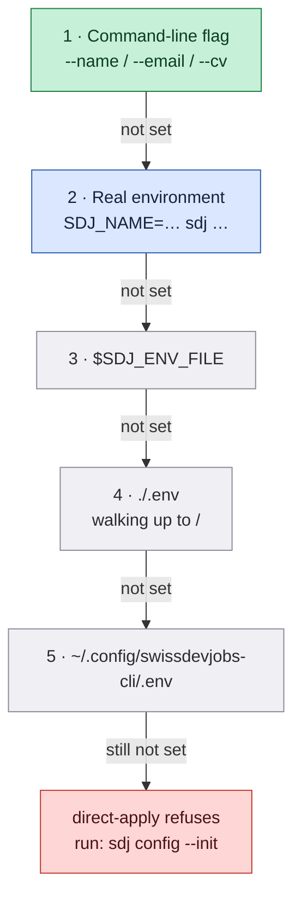
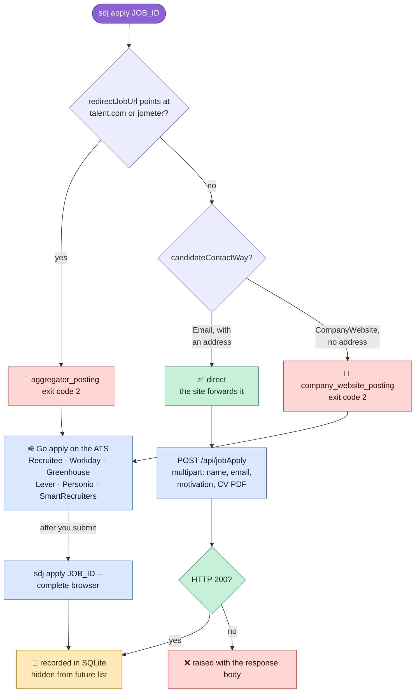
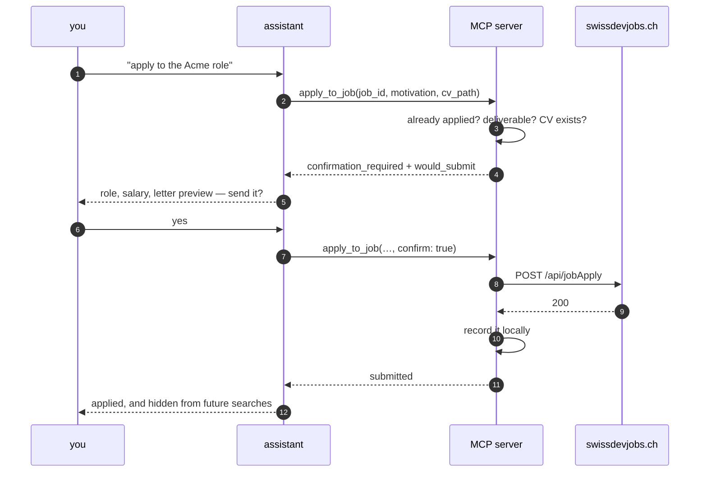
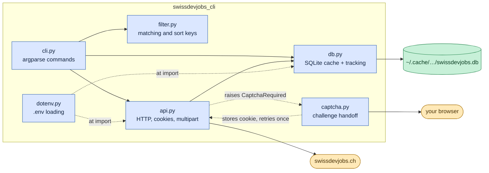
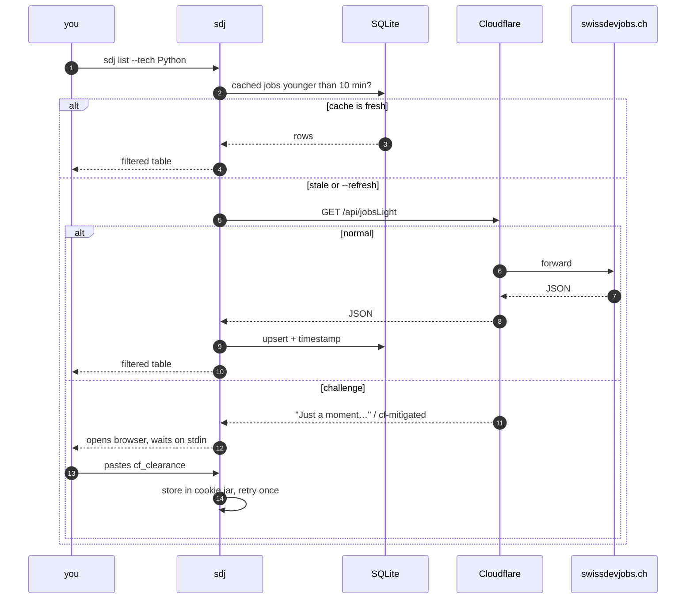
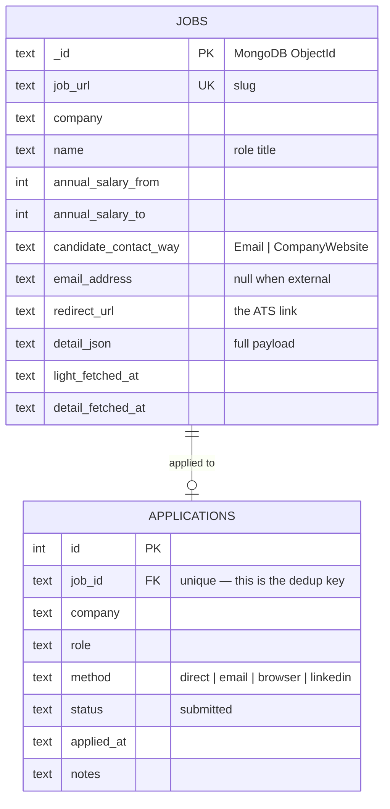

<div align="center">

# 🇨🇭 swissdevjobs-cli

**Search, filter, and apply to Swiss dev jobs — with salary data — without leaving your terminal.**

[](LICENSE)
[](https://www.python.org/)
[](pyproject.toml)
[](#mcp-server)
[](https://github.com/Stupidoodle/swissdevjobs-cli/actions/workflows/ci.yml)

</div>

---

Every posting on [swissdevjobs.ch](https://swissdevjobs.ch) is required to publish a
salary range. That makes it one of the few job boards where you can filter by pay
before you click. This CLI puts that whole feed in your shell — searchable, sortable,
scriptable, and JSON-first so an LLM agent can drive it.

It also remembers what you've already applied to, so the same job never shows up twice.

```console
$ sdj list --tech Kubernetes --remote --min-salary 130000 --sort salary
9 shown · 9 match filters · 1247 in feed · 3 hidden (already applied)
----------------------------------------------------------------------------------------
686f2a1c…  p=2026-08-19 a=2026-08-22  Senior Platform Engineer      Acme AG      Zurich    CHF 145'000–170'000  remote   Kubernetes, Go, Terraform
```

## Contents

- [Why](#why) · [Install](#install) · [Configure](#configure) · [Commands](#commands)
- [How applying works](#how-applying-works) · [Filtering](#filtering)
- [MCP server](#mcp-server) · [Under the hood](#under-the-hood) · [Cloudflare](#cloudflare)
- [Claude Code skill](#claude-code-skill) · [Development](#development)

---

## Why

| | |
|---|---|
| 💰 **Salary is a first-class filter** | `--min-salary 130000` — no more opening 40 tabs to find the range |
| 📅 **Real posting dates** | The site re-stamps `activeFrom` when it bumps a listing. This decodes the true creation time from the MongoDB ObjectId, so a "new" job that's actually four months old can't fool you |
| 🧠 **Remembers where you applied** | Local SQLite. Applied jobs vanish from `list` automatically |
| 🤖 **Agent-native** | An [MCP server](#mcp-server) plus `--json` on every command; duplicates come back as *data*, not errors |
| 📦 **Zero dependencies** | Python stdlib only. No `requests`, no `pydantic`, no supply chain |
| 🎯 **Refuses to black-hole your application** | Detects postings the site can't actually deliver and tells you where to apply instead |

---

## Install

```sh
pipx install git+https://github.com/Stupidoodle/swissdevjobs-cli
```

<details>
<summary>Other ways</summary>

```sh
# from a checkout, editable
git clone https://github.com/Stupidoodle/swissdevjobs-cli
cd swissdevjobs-cli
pipx install -e .        # or: pip install -e .
```

Not published to PyPI.
</details>

Installs two equivalent binaries: **`sdj`** and **`swissdevjobs`**. Python 3.9+.

---

## Configure

Reading jobs needs no configuration at all. Applying needs to know who you are.

```sh
sdj config --init     # writes ~/.config/swissdevjobs-cli/.env (chmod 600)
sdj config            # show what's resolved, and from where
```

Then edit the file:

```dotenv
SDJ_NAME="Your Name"
SDJ_EMAIL="you@example.com"
SDJ_CV="/absolute/path/to/cv.pdf"
```

### Where settings come from

`.env` files are read stdlib-only — no `python-dotenv` dependency. Anything already
exported in your shell always wins, so nothing on disk can silently shadow it.



Highest priority at the top. A project-local `.env` beats the global one, which is
handy if you keep a separate identity per job search.

<details>
<summary>Full variable reference</summary>

| variable | purpose |
|---|---|
| `SDJ_NAME` | applicant full name for `direct-apply` |
| `SDJ_EMAIL` | applicant email for `direct-apply` |
| `SDJ_CV` | default CV path, so you can omit `--cv` |
| `SDJ_ENV_FILE` | explicit `.env` location, checked first |
| `SDJ_CONFIG_DIR` | override `~/.config/swissdevjobs-cli` (cookie jar, `.env`) |
| `SDJ_CACHE_DIR` | override `~/.cache/swissdevjobs-cli` (SQLite database) |
| `SDJ_APPLICATIONS_LOG` | markdown application log to import on first run |

</details>

---

## Commands


Every command takes `--json`.

<details open>
<summary><b>Discover</b></summary>

```sh
sdj list                                            # everything active
sdj list --tech Python --tech Kubernetes --remote   # any of those tags, remote/hybrid
sdj list --min-salary 130000 --location Zurich --sort salary
sdj list "platform engineer" --level Senior --visa  # free text + visa sponsorship
sdj list --company Google --include-applied         # include ones you've done

sdj show 686f2a1c57370f0152e4950e                   # by id
sdj show senior-platform-engineer-acme              # …or by slug, or a substring
sdj show acme --json                                # machine-readable

sdj open acme                                       # launch the posting
sdj tech --limit 20                                 # what the market wants
```

`list` columns: **id · dates · title · company · city · salary · workplace · tags**

The date column carries two values, and the difference matters:

| | |
|---|---|
| `p=` | **posted** — real creation time, decoded from the ObjectId. Immutable. |
| `a=` | **active** — `activeFrom`, which the site re-stamps every time it bumps a listing back to the top |

A row reading `p=2026-04-02 a=2026-08-22` is a four-month-old job wearing a fresh coat
of paint. Sort by `--sort posted` (the default) to see through it.
</details>

<details open>
<summary><b>Act</b></summary>

```sh
sdj apply <id> --json                     # what route does this posting use?
sdj apply <id> --open                     # …and open the ATS while you're at it

sdj direct-apply <id> --motivation ./letter.txt
sdj direct-apply <id> --cv ./cv_de.pdf --motivation "Sehr geehrte Damen und Herren, …"
sdj direct-apply <id> --lang-skills fluent --not-eu

sdj apply <id> --complete email           # you sent it yourself — record it
sdj apply <id> --complete browser --notes "answered 3 screening questions"
```

`--motivation` takes inline text **or** a file path — it checks whether the string is
an existing file. The letter must not contain `<` or `>`; the site rejects them.
</details>

<details open>
<summary><b>Track</b></summary>

```sh
sdj applications                          # newest first
sdj applications --json --limit 500
sdj stats                                 # cached jobs, applications, db path
sdj config                                # identity + paths + which .env loaded
```
</details>

---

## How applying works

Three postings on the same board can need three completely different actions. `sdj apply`
tells you which, and `direct-apply` refuses the cases it knows would vanish.



### Why the refusals exist

`POST /api/jobApply` returns **HTTP 200 even when nobody receives your application.**
That happens in two cases:

1. **Aggregator syndication.** The listing was pulled in from talent.com or jometer.
   swissdevjobs.ch has no forwarding address for it.
2. **`candidateContactWay == "CompanyWebsite"`.** The site is only linking out to the
   company's own ATS. `emailAddressForApplications` is `null`, so there is nothing to
   forward to.

In both cases the CLI exits **2** and hands you the real apply URL rather than letting
you believe you applied. `--force` overrides if you disagree.

```console
$ sdj direct-apply some-workday-job --json
{
  "error": "company_website_posting",
  "next_action": "use_chrome_mcp",
  "apply_url": "https://acme.wd3.myworkdayjobs.com/…",
  "message": "USE CHROME MCP: visit … and drive the ATS form. …"
}
```

### Exit codes

| code | meaning |
|---|---|
| `0` | success — *including* "already applied", which is data, not failure |
| `1` | no match, bad arguments, missing identity, or a missing CV file |
| `2` | Cloudflare challenge unresolved, **or** the posting needs a browser |
| `130` | you hit Ctrl-C |

---

## Filtering

| flag | effect |
|---|---|
| `--tech X` *(repeatable)* | match **any** listed tag; add `--tech-all` to require all of them |
| `--location Zurich` | substring match on city |
| `--remote` / `--onsite` | remote+hybrid only / exclude remote |
| `--visa` | visa sponsorship only |
| `--level` | `Junior` · `Regular` · `Senior` · `Principal` · `CLevel` |
| `--language` | posting language, e.g. `English`, `German` |
| `--min-salary` / `--max-salary` | CHF per year |
| `--company` | substring match |
| `--sort` | `posted` *(default)* · `date` · `salary` · `company` |
| `--limit N` | hard cap on rows |
| `--page N --per-page N` | windowed output instead |
| `--include-applied` | stop hiding jobs you've already applied to |
| `--refresh` | bypass the cache, and bust Cloudflare's edge cache too |
| `--json` | machine-readable |

<details>
<summary>Why <code>--refresh</code> does more than skip the local cache</summary>

`/api/jobsLight` is served with `Cache-Control: max-age=3600`, and Cloudflare will
happily return a HIT that's many hours stale — an `Age` of ~80'000 s has been observed
in the wild, which hides everything posted that day. `--refresh` appends a unique
query string so the request lands on a distinct cache key, forcing a MISS and
origin-fresh data.
</details>

---

## MCP server

Point any [MCP](https://modelcontextprotocol.io) client at `swissdevjobs-mcp`
and your assistant can search, read postings, and apply — with a confirmation
gate in front of anything irreversible.

```jsonc
// Claude Code: .mcp.json  ·  Claude Desktop: claude_desktop_config.json
{
  "mcpServers": {
    "swissdevjobs": {
      "command": "swissdevjobs-mcp",
      "env": {
        "SDJ_NAME": "Your Name",
        "SDJ_EMAIL": "you@example.com",
        "SDJ_CV": "/absolute/path/to/cv.pdf"
      }
    }
  }
}
```

In Claude Code, one line does it:

```sh
claude mcp add swissdevjobs -- swissdevjobs-mcp
```

Then just ask: *"find me senior Python roles in Zurich over 140k and show me
the top five."*

### Tools

| tool | what it does | read-only |
|---|---|:--:|
| `search_jobs` | filter by pay, stack, city, remote, seniority, visa | ✅ |
| `get_job` | full posting: description, requirements, screening questions | ✅ |
| `apply_to_job` | submit through the site's own form — **gated** | ❌ |
| `list_applications` | everything recorded locally | ✅ |
| `mark_applied` | record an application made by email or on an ATS | ❌ |
| `top_technologies` | what the market is asking for right now | ✅ |

The read-only tools carry `readOnlyHint`, so a client can run them without
interrupting you. `search_jobs` returns compact rows on purpose — full
descriptions come from `get_job`, so a broad search doesn't burn context.

### The confirmation gate

An application cannot be unsent, so `apply_to_job` refuses to submit until it
is called a second time with `confirm: true`. The first call returns exactly
what *would* go out:

```jsonc
{
  "error": "confirmation_required",
  "would_submit": {
    "role": "Senior ML Engineer",
    "company": "Acme AG",
    "salary": "CHF 140'000–180'000",
    "applicant": { "name": "…", "email": "…" },
    "cv_path": "/…/cv.pdf",
    "motivation_preview": "Dear hiring team, …",
    "motivation_chars": 1180
  }
}
```

The assistant shows you that, you say yes, and only then does anything leave
your machine. Duplicates and undeliverable postings are caught *before* the
gate, so a repeat never turns into a second submission.



---

## Under the hood



### Request path



### Reverse-engineered API surface

| endpoint | purpose |
|---|---|
| `GET /api/jobsLight` | every active job, lightweight fields |
| `GET /api/job/{_id}` | full detail: description, responsibilities, requirements |
| `GET /rss` | RSS feed, an alternate bulk source |
| `POST /api/jobApply` | the site's own apply form, multipart/form-data |

No auth, no API key on the read endpoints. Responses cached in SQLite — **10 min** for
the list, **1 h** for detail.

### The database



Deduplication runs on `job_id` first, then falls back to `(company, role)` so an
application you made through LinkedIn still suppresses the same role here.

---

## Cloudflare

swissdevjobs.ch sits behind Cloudflare. Ordinary use sails through; bursts and
datacenter IPs can trip a managed challenge.

**There is no automated solver here, by design.** A headless client can't run the JS
challenge, and shipping something that tried would be both fragile and rude. Instead
the CLI hands the problem to a real human in a real browser:

1. The command blocks and prints the URL.
2. Your default browser opens it.
3. You clear the challenge, then copy `cf_clearance` from
   **DevTools → Application → Cookies → `.swissdevjobs.ch`**.
4. Paste it back. It's stored in a Netscape cookie jar at
   `~/.config/swissdevjobs-cli/cookies.txt` and the original request retries.

Run `sdj auth` up front before scripting a batch of calls.

---

## Claude Code skill

[`skill/SKILL.md`](skill/SKILL.md) wraps the CLI as a [Claude Code](https://claude.com/claude-code)
skill, so an agent can run the whole search → shortlist → apply loop for you.

```sh
mkdir -p ~/.claude/skills/swissdevjobs
cp skill/SKILL.md ~/.claude/skills/swissdevjobs/
```

```
/swissdevjobs find senior python roles in zurich over 140k and show me the top 5
```

The skill hard-stops before every irreversible submit and asks you to confirm, refuses
to type national ID or bank details into any form, and hands CAPTCHAs back to you.

---

## Layout

```
src/swissdevjobs_cli/
  api.py         HTTP client, cookie jar, challenge detection, multipart apply
  captcha.py     Interactive Cloudflare handoff (browser + paste-cookie)
  db.py          SQLite job cache and application tracking
  dotenv.py      Stdlib .env loading with shell-wins precedence
  filter.py      Matching predicates and sort keys
  payloads.py    Pure shaping shared by the CLI and MCP (never prints)
  mcp.py         JSON-RPC 2.0 server over stdio
  cli.py         argparse commands and output formatting
skill/SKILL.md   Claude Code skill wrapper
tests/           63 offline tests — no network, sandboxed database
```

---

## Development

```sh
uv sync              # dependencies and dev tools, from the lockfile
uv run pytest        # 63 tests, no network
uv run ruff check .  # lint
```

CI runs the same three on Python 3.9 and 3.13, and starts the MCP server to
verify it still completes a handshake.

---

## Please be reasonable

This talks to somebody else's website, built by a small team who chose to make salary
transparency mandatory. Keep your request volume human. Don't strip the caching. Don't
fire off applications to postings you haven't read — that wastes a real recruiter's
afternoon and poisons the well for everyone using the board honestly.

Read swissdevjobs.ch's terms before you automate anything on top of this.

---

## License

MIT — see [LICENSE](LICENSE). Not affiliated with, endorsed by, or connected to
swissdevjobs.ch.
